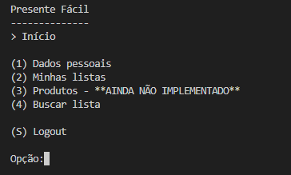
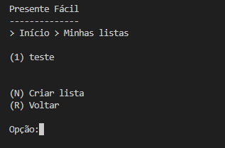
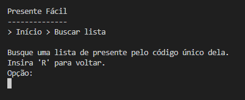

# Relatório - TP01

## Participantes
- Daniel Matos Marques

## Descrição

"Presente Fácil" é um sistema que simplifica a organização de eventos por meio do gerenciamento de listas de presentes para qualquer ocasião. Cada usuário tem controle total sobre suas listas, podendo criá-las, consultá-las, editá-las e excluí-las de forma simples e intuitiva.

Para compartilhar, o sistema gera um código NanoID, que permite que outras pessoas visualizem as listas sem expor informações sensíveis, garantindo praticidade e segurança.

## O sistema

  

  

  

  

  

  

## Classes
- `Usuario` e `ListaPresente` (Classes modelo) - Ambas extendem a classe `Registro`, usada como base das entidades.
- `ArvoreBMais` - Implementa o relacionamento **1:N** entre usuários e listas.
- `HashExtensivel` - Implementa índices (diretos e indiretos).
- `NanoID` - Responsável pelos códigos para compartilhar listas entre usuários.

---

- Há um CRUD de usuários (que estende a classe ArquivoIndexado, acrescentando Tabelas Hash Extensíveis e Árvores B+ como índices diretos e indiretos conforme necessidade) que funciona corretamente?
  **R: Sim, o CRUD de usuários funciona corretamente com índices Hash Extensíveis e B+.**
- Há um CRUD de listas (que estende a classe ArquivoIndexado, acrescentando Tabelas Hash Extensíveis e Árvores B+ como índices diretos e indiretos conforme necessidade) que funciona corretamente?
 **R: Sim, o CRUD de listas funciona corretamente com índices Hash Extensíveis e B+.**
- As listas de presentes estão vinculadas aos usuários usando o idUsuario como chave estrangeira?
 **R: Sim.**
- Há uma árvore B+ que registre o relacionamento 1:N entre usuários e listas?
 **R: Sim, através do registro em árvore B+, os usuários podem ter mais de uma lista.**
- Há uma visualização das listas de outras pessoas por meio de um código NanoID?
 **R: Sim.**
- O trabalho compila corretamente?
 **R: Sim.**
- O trabalho está completo e funcionando sem erros de execução?
 **R: Sim.**
- O trabalho é original e não a cópia de um trabalho de outro grupo?
 **R: Sim.**
