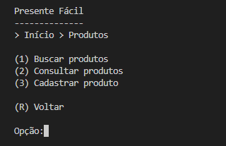
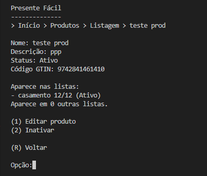
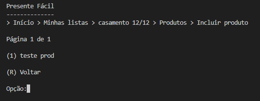
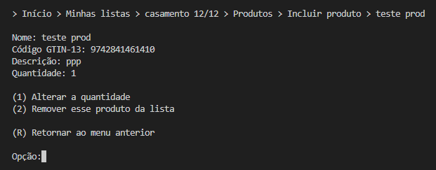

# Relatório - TP02

## Participantes
- Daniel Matos Marques

## Descrição

"Presente Fácil" é um sistema que simplifica a organização de eventos por meio do gerenciamento de listas de presentes para qualquer ocasião. Cada usuário tem controle total sobre suas listas, podendo criá-las, consultá-las, editá-las e excluí-las de forma simples e intuitiva.

Também é possível cadastrar produtos nas listas, permitindo adicionar descrição e quantidade, tornando o processo de escolha e compartilhamento dos presentes ainda mais prático e personalizado.

Para compartilhar, o sistema gera um código NanoID, que permite que outras pessoas visualizem as listas sem expor informações sensíveis, garantindo praticidade e segurança.

## O sistema

## Classes
- `Usuario`, `ListaPresente` e `Produto` (Classes modelo) - Todas extendem a classe `Registro`, usada como base das entidades.
- `ArvoreBMais` - Implementa o relacionamento **1:N** entre usuários e listas.
- `HashExtensivel` - Implementa índices (diretos e indiretos).
- `NanoID` - Responsável pelos códigos para compartilhar listas entre usuários.

---

- Há um CRUD de produtos (que estende a classe ArquivoIndexado, acrescentando Tabelas Hash Extensíveis e Árvores B+ como índices diretos e indiretos conforme necessidade) que funciona corretamente?
  **R: Sim, o CRUD de produtos funciona corretamente com índices Hash Extensíveis e B+.**
- Há um CRUD da entidade de associação ListaProduto (que estende a classe ArquivoIndexado, acrescentando Tabelas Hash Extensíveis e Árvores B+ como índices diretos e indiretos conforme necessidade) que funciona corretamente?
 **R: Sim, o CRUD da entidade de associação Lista <-> Produto funciona corretamente com índices Hash Extensíveis e B+.**
- A visão de produtos está corretamente implementada e permite consultas as listas em que o produto aparece (apenas quantidade no caso de lista de outras pessoas)?
 **R: Sim, o sistema permite consultar as listas em que o produto aparece e a quantidade de listas caso elas sejam privadas.**
- A visão de listas funciona corretamente e permite a gestão dos produtos na lista?
 **R: Sim.**
- A integridade do relacionamento entre listas e produtos está mantida em todas as operações?
 **R: Sim.**
- O trabalho compila corretamente?
 **R: Sim.**
- O trabalho está completo e funcionando sem erros de execução?
 **R: Sim.**
- O trabalho é original e não a cópia de um trabalho de outro grupo?
 **R: Sim.**

---

> Video do funcionamento do TP02 - 
